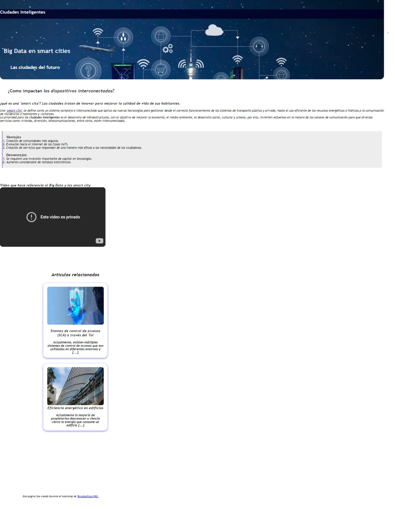

# Blog de Smart Cities con HTML y CSS
Este proyecto es un Blog que habla brevemente del Big Data en Smart Cities. 
Creado puramente con HTML5 y CSS#.

Enfacodo a la apariencia visual de un blog de articulos cientificos, ofreciendo una experiencia de navgacion similar y funcionalidades basicas.

###Caracteristicas

* **Interfaz de usuario agradable:** Inspirada en articulos cientificos, con navegacion facil y accesible.

* **Interacciones dinamica:** Efectos visuales para elementos interactivos como enlaces y botones.✨

* **Estilos modernos:** Uso de la biblioteca de Material Desing y estilos CSS modernos para una apariencia cool.👌🤖

### Tecnologias Utilizadas
+ **HTML5:** Para una estructura basica del sitio.
+ **CSS:** para el diseño y el estilo.

 ### Vista Previa del Proyecto

 ### Contacto
 Si te gustaria invitarme a colaborar en un proyecto, contactame por correo: claudia.lizett_zac@outlook.com

